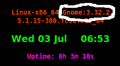

# GnomeVersionChecker

A knowning issue : 
https://unix.stackexchange.com/questions/73212/how-to-get-the-gnome-version

Requred systems : GNU/Linux 2.6.32+ x86-64 for compiled version 
or any linux system for shell script.

Move a binary/script file into /home/$USER/bin/, /usr/local/bin/ 
or any other folders listed in $PATH.

If a /home/$USER/bin/ folder doesn't exist and it isn't possible for you 
to create any files into /usr/local/bin folder, then create a
/home/$USER/bin/ folder and add it to $PATH variable of /home/$USER/.bashrc file.

> PATH=/home/$USER/bin$PATH

Using 'gnomever' with conky.

Add this line to conky config file:

> ${color lime}Gnome: ${execi 1000 gnomever}

'gnomever' has checked on Fedora 30 and Debian 9 x86_64 Linux.

